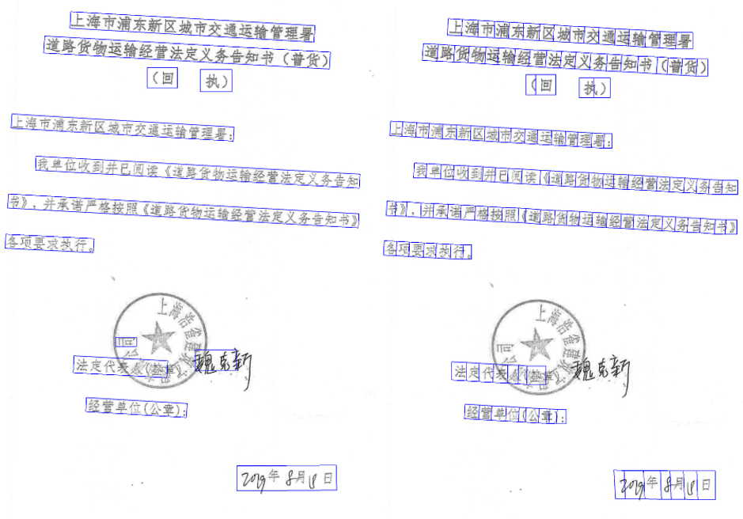

## 简介
SXOCR-V2基于PaddleOCR-2.0二次开发，旨在结合公司特有的业务数据，快速高质量的落地OCR相关应用。

## 注意
**近期更新**
- 2021-4-22 公司内测

## 特性
- 在PaddleOCR高质量预训练模型基础上，结合公司场景数据fine-tune
    - 支持中英文数字组合识别、长文本识别，暂不支持竖排文本识别
    - 检测（3.0M）+方向分类器（1.4M）+识别（5.0M）=9.4M
    - 检测（DB模型,骨干网络-MobileNetV3），识别（CRNN+CTCLoss，骨干网络-MobileNetV3）
- OCR相关组件
    - 基于PPOCRLabel的半自动数据标注工具，支持快速高效的数据标注
    - 数据合成工具Style-Text：批量合成大量与目标场景类似的图像
    - 可运行于Linux、Windows，支持Linux和Windows加密运行
    - 支持自定义训练，采用了python预测推理部署方案
    - 支持行文本定位与识别，单字定位和识别，支持倾斜文本的定位与识别，支持倾斜文本内单字的定位与识别
    - 支持CPU和GPU

## 效果展示

<div align="center">
    
</div>

## 文本检测模型fine-tune
- 配置文件
configs/det/ch_ppocr_v2.0/ch_det_mv3_db_v2.0.yml
- 对比PaddleOCR,配置文件做了如下改动
    - 数据增益，由{ 'type': Affine, 'args': { 'rotate': [-10, 10] } }修改为{ 'type': Affine, 'args': { 'rotate': [-3, 3] } }
    - 样本制作，MakeBorderMap和MakeShrinkMap由shrink_ratio: 0.4修改为shrink_ratio: 0.6
    - 样本训练，如果是CPU，batch_size_per_card: 2；如果是GPU，batch_size_per_card: 8；num_workers: 4
- 构造训练数据集roadmap
    - 将候标注图放在以日期命名的文件夹下，使用PPOCR进行标注，当其内容为“###”时，表示该文本框无效，在训练时会跳过。
    - 使用train_data下的脚本data_split_for_train_test.py划分训练和测试集
    - 下载骨干网络的预训练模型，可参考PaddleOCR官网
    - 根据训练环境，修改配置文件中的 use_gpu 字段，在ch_det_mv3_db_v2.0.yml中设置好预训练模型路径
    - 启动训练 python3 tools/train.py
## 文本识别模型fine-tune
- 构造训练数据集roadmap
    - 最终训练集应有如下结构
    ````
    |-train_data
    |-rec
    |- rec_gt_train.txt
    |- train
        |- word_001.png
        |- word_002.jpg
        |- word_003.jpg
        | ...
    ````
    - 下载预训练模型并解压
    - 修改configs.config.py中的train_config_path为configs/rec/ch_ppocr_v2.0/rec_chinese_lite_train_v2.0.yml, python tools/train.py
    - 仅 linux 训练，可将配置文件中设置 distort: true，颜色空间转换(cvtColor)、模糊(blur)、抖动(jitter)、噪声(Gasuss noise)、随机切割(random crop)、透视(perspective)、颜色反转(reverse)以50%概率选择  
   
## 预测部署
- 基于Python预测引擎推理--训练过程中的checkpoints转inference  
因为inference模型会额外保存模型的结构信息，在预测部署、加速推理上性能优越，灵活方便，适合于实际系统集成。  
python tools/export_model.py -c configs/det/ch_ppocr_v2.0/ch_det_mv3_db_v2.0.yml -o Global.checkpoints=./output/ch_db_mv3/best_accuracy Global.load_static_weights=False Global.save_inference_dir=./inference/det_db/

## 加密部署
- Linux平台，py转so
- windows平台，py转pyd

**具体方法参见飞书文档——https://w95cre6dti.feishu.cn/docs/doccnFAc7PQ5EBClU4Fle7GY1xh#k79J6O**  


